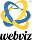

Webviz is designed for analysing FMU model results, and this webviz example is based on multi-realization data sets (ensembles) generated from the synthetic Drogon FMU model.
A webviz app is created from a yaml configuration file, and this app was created with the command:
```bash
webviz build <name_of_config_yaml_file>
```
Alternatively one can crete a portable app, see [portable-vs-non-portable](https://equinor.github.io/webviz-subsurface/#/?id=portable-vs-non-portable) for more info. 

This example includes a menu layout with sections and groups (grouping w/icons).
The menu can be pinned/unpinned and the the section groups can be collapsed/uncollapsed. There is also a search function for filtering of the menu.
The configuration file used for making this app is included in *"Webviz Intro - Information - How was this made"*.

Click on the different pages in the **Webviz Intro** and the **Webviz Analysis** sections to start exploring some of the Webviz capabilities and plugins. Follow the [wiki tutorial exercises](https://wiki.equinor.com/wiki/index.php/FMU_drogon_tutorial/webviz) to get a guided introduction to the plugins included in this example app.

If you want to explore webviz beyond this example, a good starting point is the [webviz-subsurface live demo app](https://webviz-subsurface-example.azurewebsites.net/front-page). 
